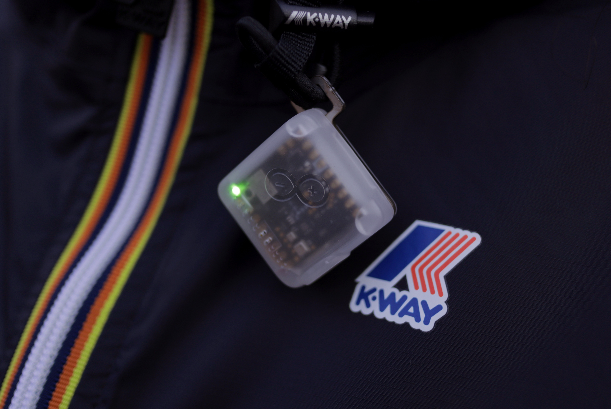

# Edge Impulse x Arduino x K-Way - Outdoor Activity Tracker
A wearable Nicla Sense ME that can measure both the environment, and your outdoor activities using machine learning.

Project documentation: https://docs.edgeimpulse.com/experts/arduino-kway-outdoor-activity-tracker

This repository contains the following use cases for the Arduino Nicla Sense ME board:
- **Weather prediction** - `arduino/components/nicla_sense_ingestion_weather` & `arduino/components/led_ble_weather`
- **Activity tracking** - `arduino/components/nicla_sense_ingestion_climbing`
- **Data gathering for ML** - `web`

